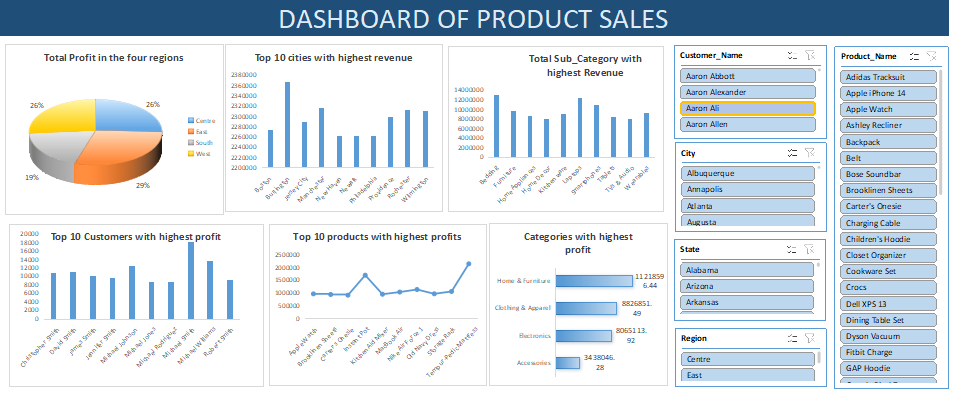

# Project 1

**Title:** [Global Superstore Sales](Global_Sales.pbix)

**Tools Used:** Power BI

**Project Description:** This project analyzes the sales performance of the Global Superstore in 2023, providing data-driven insights into revenue trends, profitability, and customer behavior across various regions, segments, and product categories. Using tools like Power BI, Excel, and SQL, the dataset was cleaned, transformed, and visualized to uncover key patterns affecting business performance.

**Key findings:** The analysis focused on identifying top-performing Customers, high-revenue product lines, and Sales persons, while also evaluating order profitability, customer segments, and shipping efficiency. Interactive dashboards were developed to enable stakeholders to track KPIs such as Total Sales, Order Value, and Market Performance in real time.

**Dashboard Overview:** The insights from this project support strategic decision-making, helping management optimize pricing, improve inventory distribution, and enhance customer satisfaction globally.

# Project 2

**Title:** [Product Sales Performance](product_sales_dashboard.xls)

**Tools Used:** Microsoft Excel (Power Query, PivotTables, Data Visualization, Dashboard Design, Sales Analysis, Business Insights)

**Project Description:** This project focuses on analyzing and visualizing product sales performance for 2023 using Microsoft Excel. The goal was to uncover key insights into revenue, profit, and sales trends across different product categories, customer segments, and regions. The dataset was cleaned and organized using Excel’s data tools, including PivotTables, Power Query, and Formulas, to ensure accuracy and consistency. An interactive Excel dashboard was then created to help track key performance indicators such as Total Sales, Profit Margin, Quantity Sold, and Average Discount.

**Key findings:** The analysis reveals that the profit margins across the four regions show only a slight variation, with a difference of approximately 10% between the highest and lowest performing regions. This indicates relatively consistent profitability across markets. Additionally, Michael Smith stands out as the top customer, generating a total profit of $18,081.21. Among products, the Tempur-Pedic Mattress recorded the highest profit contribution, while the Home and Furniture category emerged as the most profitable product segment overall.

**Dashboard Overview:** Through this analysis, I identified top-performing and underperforming products, examined sales trends over time, and provided actionable insights to support marketing decisions.

