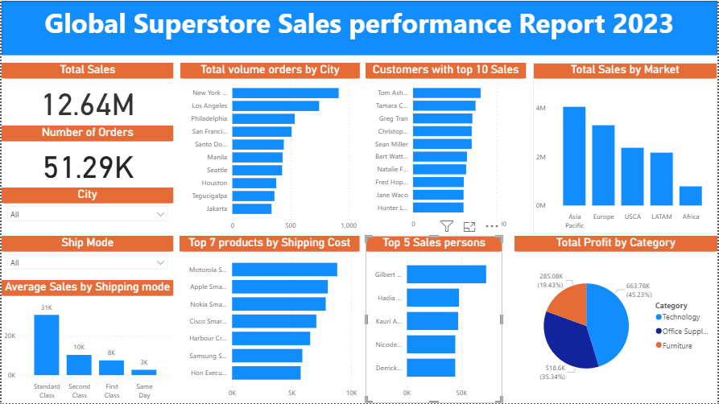

# Project 1

**Title:** Global Superstore Sales

**Tools Used:** Power BI

**Project Description:** This project analyzes the sales performance of the Global Superstore in 2023, providing data-driven insights into revenue trends, profitability, and customer behavior across various regions, segments, and product categories. Using tools like Power BI, Excel, and SQL, the dataset was cleaned, transformed, and visualized to uncover key patterns affecting business performance.

**Key findings:** The analysis focused on identifying top-performing Customers, high-revenue product lines, and Sales persons, while also evaluating order profitability, customer segments, and shipping efficiency. Interactive dashboards were developed to enable stakeholders to track KPIs such as Total Sales, Order Value, and Market Performance in real time.

**Dashboard Overview:** The insights from this project support strategic decision-making, helping management optimize pricing, improve inventory distribution, and enhance customer satisfaction globally.

