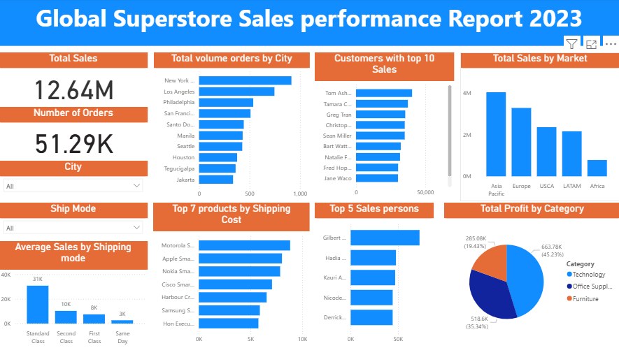
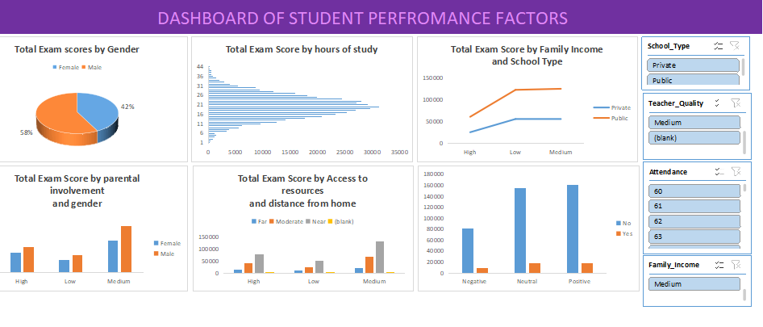

# Project 1

**Title:** [Global Superstore Sales](Global_Sales.pbix)

**Tools Used:** Power BI

**Project Description:** The Global Superstore Sales Performance Dashboard provides an in-depth analysis of the company’s sales operations across multiple regions — Africa, Europe, Asia Pacific, USCA, and LATAM — for the year 2023. The project aims to uncover insights into total sales, order distribution, shipping costs, customer profitability, and sales performance by market.

Using Microsoft Excel, raw transactional data was cleaned, structured, and analyzed to identify top-performing products, customers, and sales representatives. The dashboard offers a consolidated view of business performance and supports management in making data-driven strategic decisions to improve profitability, operational efficiency, and regional market focus.

**Key findings:** Key Findings:

The total sales volume showed Asia Pacific substantial has more sales than the other Market areas with Africa contributing the least revenue share.

The product with the highest shipping cost was primarily Motorola smart phone.

The top 5 outstanding sales persons showed the first to be Gilbert Wolff with total sales of over £70,000.

The top 10 customers collectively contributed a major percentage of the company’s annual revenue, highlighting key accounts crucial for business growth.

Among all 3 categories of product, Technology products had almost 50% of the entire profit margin, Office Supplies was next to it with approximately 35% while Furniture had exactly 19.43%.

**Dashboard Overview:** Dashboard Overview:

The interactive Excel dashboard offers a comprehensive visualization of key performance indicators (KPIs) through dynamic charts, pivot tables, and slicers. It allows users to filter data by region, product, or sales representative for targeted insights.

The dashboard highlights:

Total Sales and Number of Orders by region and category
Top 7 Products by Shipping Cost
Top 5 Sales Representatives by Revenue
Top 10 Customers by Total Sales
Regional Sales Distribution across Africa, Europe, Asia Pacific, USCA, and LATAM
Comparative insights on profit margins and shipping performance.

# Project 2

**Title:** [Student_performance](product_sales_dashboard.xls)

**Tools Used:** Microsoft Excel (Power Query, PivotTables, Data Visualization, Dashboard Design, Sales Analysis, Business Insights)

**Project Description:** The Student Performance Analysis project explores the relationship between academic outcomes and key influencing factors such as exam scores, gender, parental involvement, distance from home, family income, and school type. The aim was to identify patterns that impact student achievement and provide actionable insights for improving educational performance and support systems.

Using Microsoft Excel, the dataset was cleaned, transformed, and analyzed to uncover meaningful trends. The resulting interactive dashboard presents a comprehensive view of student performance, helping educators, policymakers, and stakeholders make informed decisions to enhance learning outcomes and equity in education.

**Key findings:**

Parental involvement showed a strong positive correlation with higher exam scores especially for male students with medium parental engagement performed significantly better than those with high and low involvement.

Family income and School type influenced performance as well; students from medium-income families tended to score better than those with high-icome and also Students attending public perform better than those attending private schools.

Students staying close to the school with more access to resources performed better than those that don't.

Gender performance differences revealed clearly that the male students scored higher than the female students.

Public school students generally outperformed their private school counterparts, particularly in consistency and overall average scores.

**Dashboard Overview:** The Excel dashboard offers an intuitive and visual summary of student performance metrics across various dimensions. It includes dynamic charts, pivot tables, and slicers that allow users to explore data interactively based on gender, income level, and parental involvement.

